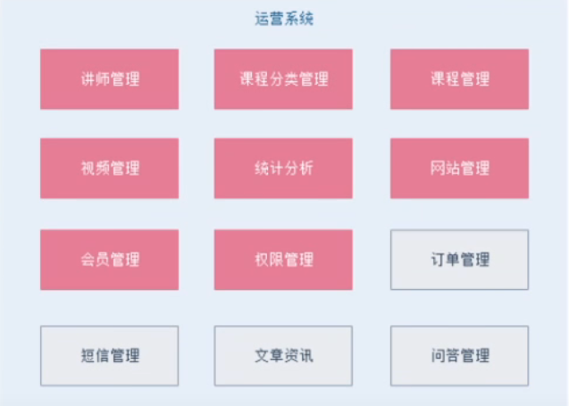
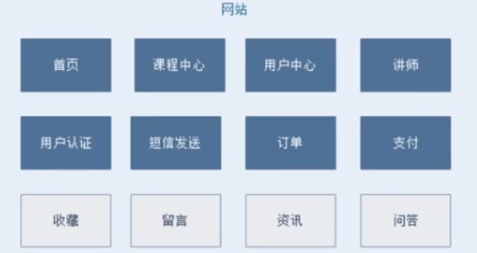
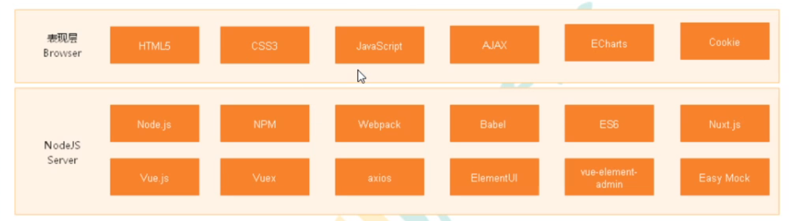

# 谷粒学院

## 系统后台



- 讲师管理模块

- 课程分类管理模块

- 课程管理模块

- 统计分析模块

- 订单管理

- banner管理

- 权限管理

## 系统前台



- 首页数据管理模块

- 讲师列表和详情

- 课程列表和课程详情

- 登陆和注册功能

- 微信扫描登录

- 微信扫描支付

# 项目开发技术

前后端分离开发

## 后端技术


springboot

springcloud

mybatisplus

springsecurity

redis

maven

easyexcel

jwt

oauth2

## 前端技术



vue

element-ui

axios

nodejs

## 其他技术

阿里云oos

阿里云视频点播服务

阿里云短信服务

docker

微信支付和登录

git

jenkins

# Mybatis-plus文档

https://baomidou.com/

## 主键策略雪花算法

业务分库`无法使用join`、`事务一致性问题`、`服务器成本问题`

主从复制和读写分离

数据库分表`垂直拆分`、`水平拆分`

```java
@TableId(typer = IdType.ADDIGN_ID)
private String id;
```

## 公共字段自动填充

像创建人、创建时间、修改人、修改时间等等

```java
@TableField(fill = FieldFill.INSERT)
private LocalDateTime createTime;

数据库id使用bigint类型，长度设置为20
```

## 乐观锁插件

```java
// 插件综合体
@Bean
public MybatisPlusInterceptor mybatisPlusInterceptor() {
    MybatisPlusInterceptor interceptor = new MybatisPlusInterceptor();
    // 分页插件
    interceptor.addInnerInterceptor(new PaginationInnerInterceptor(DbType.MYSQL));
    // 乐观锁
    interceptor.addInnerInterceptor(new OptimisticLockerInnerInterceptor());
    return interceptor;
}
```

## 分页插件

```java
@Test
public void page(){
    Page<User> page = new Page<User>(1,3);
    Page<User> userPage = userMapper.selectPage(page,null);
    List<User> records = userPage.getRecords();
    records.forEach(System.out::println);

}


// 去除不必要的字段，返回指定的列
@Test
public void pageMap(){
    QueryWrapper<User> queryWrapper = new QueryWrapper<>();
    queryWrapper.select("id", "name");
    Page<Map<String,Object>> page = new Page<>(1,3);
    Page<Map<String, Object>> param = userMapper.selectMapsPage(page, queryWrapper);
    List<Map<String, Object>> records = param.getRecords();
    records.forEach(System.out::println);
}
```

## 逻辑删除

```java
ALTER TABLE `user` ADD COLUMN `deleted` boolean DEFAULT FALSE

// 局部配置逻辑删除
@TableLogic
private Integer deleted;
```

# 项目全局配置

## 一、JDK

compiler`java8` 

## 二、编码

file encoding `UTF-8`

## 三、maven

`仓库`

# 项目分层

- repo-glxy
  - canal_client:canal数据库表同步模块（统计同步数据）
  - common
    - common_util:工具类模块，所有模块都可以依赖于它
    - service_base:service服务的base包，包含service服务的公共配置类，所有的service模块都依赖于它
    - spring_security:认证和授权模块，需要认证授权的service服务依赖于它
  - infrastructure:基础服务模块父节点
    - api_gateway:api网关服务
  - service：api接口服务节点
    - service——acl：用户权限管理api接口服务（用户管理、用户角色管理、权限管理）
    - service_cms:cms api接口服务
    - service_edu：教学相关api接口服务
    - service_sms：短信api接口服务
    - service_order:订单相关api接口服务
    - service_oss：阿里云ossapi接口服务
    - service_statistics：统计报表api接口服务
    - service_ucenter：会员api接口服务
    - service_vod：视频点播api接口服务

# 代码生成器

```java
package com.cj.guli.service.edu.commom;

import com.baomidou.mybatisplus.annotation.DbType;
import com.baomidou.mybatisplus.annotation.FieldFill;
import com.baomidou.mybatisplus.annotation.IdType;
import com.baomidou.mybatisplus.generator.AutoGenerator;
import com.baomidou.mybatisplus.generator.config.DataSourceConfig;
import com.baomidou.mybatisplus.generator.config.GlobalConfig;
import com.baomidou.mybatisplus.generator.config.PackageConfig;
import com.baomidou.mybatisplus.generator.config.StrategyConfig;
import com.baomidou.mybatisplus.generator.config.po.TableFill;
import com.baomidou.mybatisplus.generator.config.rules.DateType;
import com.baomidou.mybatisplus.generator.config.rules.NamingStrategy;
import org.junit.Test;

import java.util.ArrayList;

/**
 * mybatis-plus版本在3.0.5左右使用
 *
 * @author
 * @since 2018/12/13
 */
public class CodeGenerator {

    @Test
    public void run() {

        // 1、创建代码生成器
        AutoGenerator mpg = new AutoGenerator();

        // 2、全局配置
        GlobalConfig gc = new GlobalConfig();
        String projectPath = System.getProperty("user.dir");
        gc.setOutputDir(projectPath + "/src/main/java");
        gc.setAuthor("jinmunan");
        gc.setOpen(false); //生成后是否打开资源管理器
        gc.setFileOverride(false); //重新生成时文件是否覆盖
        gc.setServiceName("%sService");    //去掉Service接口的首字母I
        gc.setIdType(IdType.ASSIGN_ID); //主键策略
        gc.setDateType(DateType.ONLY_DATE);//定义生成的实体类中日期类型
        gc.setSwagger2(true);//开启Swagger2模式
        mpg.setGlobalConfig(gc);

        // 3、数据源配置
        DataSourceConfig dsc = new DataSourceConfig();
        // dsc.setUrl("jdbc:mysql://91.200.242.122:3306/ly-db-glxy?useUnicode=true&characterEncoding=utf8&zeroDateTimeBehavior=convertToNull&useSSL=true&serverTimezone=GMT%2B8");
        dsc.setUrl("jdbc:mysql://localhost:3306/ly-db-glxy-edu?useUnicode=true&useSSL=false&characterEncoding=UTF-8&serverTimezone=UTC");
        dsc.setDriverName("com.mysql.cj.jdbc.Driver");
        dsc.setUsername("root");
        dsc.setPassword("123456");
        dsc.setDbType(DbType.MYSQL);
        mpg.setDataSource(dsc);

        // 4、包配置
        PackageConfig pc = new PackageConfig();
        pc.setModuleName("edu"); //模块名
        pc.setParent("com.cj.guli.service");
        pc.setController("controller");
        pc.setEntity("entity");
        pc.setService("service");
        pc.setMapper("mapper");
        mpg.setPackageInfo(pc);

        // 5、策略配置
        StrategyConfig strategy = new StrategyConfig();
//        strategy.setInclude("edu_teacher");
        strategy.setNaming(NamingStrategy.underline_to_camel);//数据库表映射到实体的命名策略
        strategy.setTablePrefix(pc.getModuleName() + "_"); //生成实体时去掉表前缀

        strategy.setColumnNaming(NamingStrategy.underline_to_camel);//数据库表字段映射到实体的命名策略
        strategy.setEntityLombokModel(true); // lombok 模型 @Accessors(chain = true) setter链式操作

        // 逻辑删除
        strategy.setLogicDeleteFieldName("is_deleted");//逻辑删除字段名
        strategy.setEntityBooleanColumnRemoveIsPrefix(true);//去掉布尔值的is_前缀

        //自动填充
        TableFill gmtCreate = new TableFill("gmt_create", FieldFill.INSERT);
        TableFill gmtModified = new TableFill("gmt_modified", FieldFill.INSERT_UPDATE);
        ArrayList<TableFill> tableFills = new ArrayList<>();
        tableFills.add(gmtCreate);
        tableFills.add(gmtModified);
        strategy.setTableFillList(tableFills);

        strategy.setRestControllerStyle(true); //restful api风格控制器
        strategy.setControllerMappingHyphenStyle(true); //url中驼峰转连字符
        mpg.setStrategy(strategy);

        //设置BaseEntity
        strategy.setSuperEntityClass("com.cj.guli.service.edu.base.model.BaseEntity");
        // 删除表里的公共字段,填写BaseEntity中的公共字段
        strategy.setSuperEntityColumns("id", "gmt_create", "gmt_modified");

        // 6、执行
        mpg.execute();
    }
}
```

# 返回统一的时间格式

```yml
# 统一返回的json时间格式
jackson:
	date-format: yyyy-MM-dd HH:mm:ss
		time-zone: GMT+8
		
# 个性化时间日期的注解
@JsonFormat(timezone = "GMT+8",pattern = "yyyy-MM-dd")
```

# swagger文档

```java
package com.cj.guli.service.edu.base.config;


import org.springframework.context.annotation.Bean;
import org.springframework.context.annotation.Configuration;
import springfox.documentation.builders.ApiInfoBuilder;
import springfox.documentation.builders.PathSelectors;
import springfox.documentation.builders.RequestHandlerSelectors;
import springfox.documentation.service.ApiInfo;
import springfox.documentation.service.Contact;
import springfox.documentation.spi.DocumentationType;
import springfox.documentation.spring.web.plugins.Docket;
import springfox.documentation.swagger2.annotations.EnableSwagger2WebMvc;

import java.util.function.Predicate;

/**
 * Created by Jinmunan
 * 2022/6/10
 * 0:00
 */
@Configuration
/*不能和swagger2一起使用 否则会爆红*/
@EnableSwagger2WebMvc
public class Knife4jConfiguration {

    @Bean
    public Docket webAPIConfig() {
        return new Docket(DocumentationType.SWAGGER_2)
                .apiInfo(webApiInfo())
                //分组名称
                .groupName("webAPI")
                .select()
                //这里指定Controller扫描包路径
                .apis(RequestHandlerSelectors.basePackage("com.cj.guli"))
//                .paths(PathSelectors.any())
                .paths(PathSelectors.regex("/api/.*"))
                .build();
    }

    @Bean
    public Docket adminAPIConfig() {
        return new Docket(DocumentationType.SWAGGER_2)
                .apiInfo(adminApiInfo())
                //分组名称
                .groupName("adminAPI")
                .select()
                //这里指定Controller扫描包路径
                .apis(RequestHandlerSelectors.basePackage("com.cj.guli"))
                .paths(PathSelectors.regex("/admin/.*"))
                .build();
    }

    private ApiInfo webApiInfo() {
        return new ApiInfoBuilder()
                .title("谷粒学苑支付")
                .description("谷粒学苑接口文档")
                // 服务条款地址
                // .termsOfServiceUrl("http://www.xx.com/")
                .contact(new Contact("jinmunan", "https://www.klrss.com", "zn9230428578@gmail.com"))
                .version("1.0")
                .build();
    }

    private ApiInfo adminApiInfo() {
        return new ApiInfoBuilder()
                .title("后台管理系统谷粒学苑支付")
                .description("谷粒学苑接口文档")
                // 服务条款地址
                // .termsOfServiceUrl("http://www.xx.com/")
                .contact(new Contact("jinmunan", "https://www.klrss.com", "zn9230428578@gmail.com"))
                .version("1.0")
                .build();
    }
}
```

# 统一返回结果

```json
{
    "success":布尔,//响应是否成功
    "code":数字,//响应码
    "message":字符串,//返回消息
    "data":HashMap,//返回数据，键值对中
}
```

# R对象

```java
package com.cj.guli.common.base.result;

import io.swagger.annotations.ApiModel;
import io.swagger.annotations.ApiModelProperty;
import lombok.Data;

import java.util.HashMap;
import java.util.Map;

/**
 * @author 响应返回结果
 * @since 2019/12/25
 */
@Data
@ApiModel(value = "全局统一返回结果")
public class R {

    @ApiModelProperty(value = "是否成功")
    private Boolean success;

    @ApiModelProperty(value = "返回码")
    private Integer code;

    @ApiModelProperty(value = "返回消息")
    private String message;

    @ApiModelProperty(value = "返回数据")
    private Map<String, Object> data = new HashMap<String, Object>();

    public R(){}

    // 成功
    public static R ok(){
        R r = new R();
        r.setSuccess(ResultCodeEnum.SUCCESS.getSuccess());
        r.setCode(ResultCodeEnum.SUCCESS.getCode());
        r.setMessage(ResultCodeEnum.SUCCESS.getMessage());
        return r;
    }

    // 失败
    public static R error(){
        R r = new R();
        r.setSuccess(ResultCodeEnum.UNKNOWN_REASON.getSuccess());
        r.setCode(ResultCodeEnum.UNKNOWN_REASON.getCode());
        r.setMessage(ResultCodeEnum.UNKNOWN_REASON.getMessage());
        return r;
    }

    // 设置枚举的返回类型
    public static R setResult(ResultCodeEnum resultCodeEnum){
        R r = new R();
        r.setSuccess(resultCodeEnum.getSuccess());
        r.setCode(resultCodeEnum.getCode());
        r.setMessage(resultCodeEnum.getMessage());
        return r;
    }

    // 单纯的设置
    public R success(Boolean success){
        this.setSuccess(success);
        return this;
    }
    // 单纯的设置
    public R message(String message){
        this.setMessage(message);
        return this;
    }
    // 单纯的设置
    public R code(Integer code){
        this.setCode(code);
        return this;
    }

    // 键和值设置到hashmap中
    public R data(String key, Object value){
        this.data.put(key, value);
        return this;
    }

    // 直接传入一个hashmap
    public R data(Map<String, Object> map){
        this.setData(map);
        return this;
    }
}
```

# 统一异常处理

```java
package com.cj.guli.service.edu.base.handler;


import com.cj.guli.common.base.result.R;
import com.cj.guli.common.base.result.ResultCodeEnum;
import com.cj.guli.common.base.util.ExceptionUtils;
import lombok.extern.slf4j.Slf4j;
import org.springframework.http.converter.HttpMessageNotReadableException;
import org.springframework.jdbc.BadSqlGrammarException;
import org.springframework.web.bind.annotation.ControllerAdvice;
import org.springframework.web.bind.annotation.ExceptionHandler;
import org.springframework.web.bind.annotation.ResponseBody;

/**
 * 统一异常处理器
 * @author jinmunan
 * @since 2020/4/1
 */
@ControllerAdvice
@Slf4j
public class GlobalExceptionHandler {

    @ExceptionHandler(Exception.class)
    @ResponseBody
    public R error(Exception e) {
        //e.printStackTrace();
        log.error(ExceptionUtils.getMessage(e));
        return R.error();
    }

    // 捕获特定的异常
    @ExceptionHandler(BadSqlGrammarException.class)
    @ResponseBody
    public R error(BadSqlGrammarException e) {
        log.error(ExceptionUtils.getMessage(e));
        return R.setResult(ResultCodeEnum.BAD_SQL_GRAMMAR);
    }

    // 捕获特定的异常
    @ExceptionHandler(HttpMessageNotReadableException.class)
    @ResponseBody
    public R error(HttpMessageNotReadableException e) {
        log.error(ExceptionUtils.getMessage(e));
        return R.setResult(ResultCodeEnum.JSON_PARSE_ERROR);
    }
}
```

# 统一日志处理

> springboot内置logback日志处理

```xml
<?xml version="1.0" encoding="UTF-8"?>
<configuration  scan="true" scanPeriod="10 seconds">

    <contextName>logback</contextName>
    <!--生成的文件地址-->
    <property name="log.path" value="D:/project/helen/guli_log/edu" />

    <!--控制台日志格式：彩色日志-->
    <!-- magenta:洋红 -->
    <!-- boldMagenta:粗红-->
    <!-- cyan:青色 -->
    <!-- white:白色 -->
    <!-- magenta:洋红 -->
    <property name="CONSOLE_LOG_PATTERN"
              value="%yellow(%date{yyyy-MM-dd HH:mm:ss}) |%highlight(%-5level) |%blue(%thread) |%blue(%file:%line) |%green(%logger) |%cyan(%msg%n)"/>

    <!--文件日志格式-->
    <property name="FILE_LOG_PATTERN"
              value="%date{yyyy-MM-dd HH:mm:ss} |%-5level |%thread |%file:%line |%logger |%msg%n" />

    <!--编码-->
    <property name="ENCODING"
              value="UTF-8" />

    <!--输出到控制台-->
    <appender name="CONSOLE" class="ch.qos.logback.core.ConsoleAppender">
        <filter class="ch.qos.logback.classic.filter.ThresholdFilter">
            <!--日志级别-->
            <level>DEBUG</level>
        </filter>
        <encoder>
            <!--日志格式-->
            <Pattern>${CONSOLE_LOG_PATTERN}</Pattern>
            <!--日志字符集-->
            <charset>${ENCODING}</charset>
        </encoder>
    </appender>

    <!--输出到文件-->
    <!--日志滚动策略,每一天的日志按照日期都自动归档到文件夹中,和按照文件大小归档-->
    <appender name="INFO_FILE" class="ch.qos.logback.core.rolling.RollingFileAppender">
        <!--日志过滤器：此日志文件只记录INFO级别的-->
        <filter class="ch.qos.logback.classic.filter.LevelFilter">
            <level>INFO</level>
            <onMatch>ACCEPT</onMatch>
            <onMismatch>DENY</onMismatch>
        </filter>
        <!-- 正在记录的日志文件的路径及文件名 -->
        <file>${log.path}/log_info.log</file>
        <encoder>
            <pattern>${FILE_LOG_PATTERN}</pattern>
            <charset>${ENCODING}</charset>
        </encoder>
        <!-- 日志记录器的滚动策略，按日期，按大小记录 -->
        <rollingPolicy class="ch.qos.logback.core.rolling.TimeBasedRollingPolicy">
            <!-- 每天日志归档路径以及格式 -->
            <fileNamePattern>${log.path}/info/log-info-%d{yyyy-MM-dd}.%i.log</fileNamePattern>
            <timeBasedFileNamingAndTriggeringPolicy class="ch.qos.logback.core.rolling.SizeAndTimeBasedFNATP">
                <maxFileSize>100MB</maxFileSize>
            </timeBasedFileNamingAndTriggeringPolicy>
            <!--日志文件保留天数-->
            <maxHistory>15</maxHistory>
        </rollingPolicy>
    </appender>

    <appender name="WARN_FILE" class="ch.qos.logback.core.rolling.RollingFileAppender">
        <!-- 日志过滤器：此日志文件只记录WARN级别的 -->
        <filter class="ch.qos.logback.classic.filter.LevelFilter">
            <level>WARN</level>
            <onMatch>ACCEPT</onMatch>
            <onMismatch>DENY</onMismatch>
        </filter>
        <!-- 正在记录的日志文件的路径及文件名 -->
        <file>${log.path}/log_warn.log</file>
        <encoder>
            <pattern>${FILE_LOG_PATTERN}</pattern>
            <charset>${ENCODING}</charset> <!-- 此处设置字符集 -->
        </encoder>
        <!-- 日志记录器的滚动策略，按日期，按大小记录 -->
        <rollingPolicy class="ch.qos.logback.core.rolling.TimeBasedRollingPolicy">
            <fileNamePattern>${log.path}/warn/log-warn-%d{yyyy-MM-dd}.%i.log</fileNamePattern>
            <timeBasedFileNamingAndTriggeringPolicy class="ch.qos.logback.core.rolling.SizeAndTimeBasedFNATP">
                <maxFileSize>100MB</maxFileSize>
            </timeBasedFileNamingAndTriggeringPolicy>
            <!--日志文件保留天数-->
            <maxHistory>15</maxHistory>
        </rollingPolicy>
    </appender>

    <appender name="ERROR_FILE" class="ch.qos.logback.core.rolling.RollingFileAppender">
        <!-- 日志过滤器：此日志文件只记录ERROR级别的 -->
        <filter class="ch.qos.logback.classic.filter.LevelFilter">
            <level>ERROR</level>
            <onMatch>ACCEPT</onMatch>
            <onMismatch>DENY</onMismatch>
        </filter>
        <!-- 正在记录的日志文件的路径及文件名 -->
        <file>${log.path}/log_error.log</file>
        <encoder>
            <pattern>${FILE_LOG_PATTERN}</pattern>
            <charset>${ENCODING}</charset> <!-- 此处设置字符集 -->
        </encoder>
        <!-- 日志记录器的滚动策略，按日期，按大小记录 -->
        <rollingPolicy class="ch.qos.logback.core.rolling.TimeBasedRollingPolicy">
            <fileNamePattern>${log.path}/error/log-error-%d{yyyy-MM-dd}.%i.log</fileNamePattern>
            <timeBasedFileNamingAndTriggeringPolicy class="ch.qos.logback.core.rolling.SizeAndTimeBasedFNATP">
                <maxFileSize>100MB</maxFileSize>
            </timeBasedFileNamingAndTriggeringPolicy>
            <!--日志文件保留天数-->
            <maxHistory>15</maxHistory>
        </rollingPolicy>
    </appender>

    <!--spring.profiles.active: dev-->
    <!--都是从配置文件读取替换的-->
    <!--开发环境-->
    <springProfile name="dev">
        <!--可以灵活设置此处，从而控制日志的输出-->
        <root level="DEBUG">
            <!--控制台-->
            <appender-ref ref="CONSOLE" />
            <!--info文件-->
            <appender-ref ref="INFO_FILE" />
            <!--warn文件-->
            <appender-ref ref="WARN_FILE" />
            <!--error文件-->
            <appender-ref ref="ERROR_FILE" />
        </root>
    </springProfile>

    <!--生产环境-->
    <springProfile name="pro">
        <root level="ERROR">
            <!--只输出错误文件-->
            <appender-ref ref="ERROR_FILE" />
        </root>
    </springProfile>

</configuration>
```

# 前端技术

vue-elemet-admin：后台管理系统

https://panjiachen.github.io/vue-element-admin-site/zh/guide/

```
├── build                      // 构建相关  
├── config                     // 配置相关
├── src                        // 源代码
│   ├── api                    // 所有请求
│   ├── assets                 // 主题 字体等静态资源
│   ├── components             // 全局公用组件
│   ├── directive              // 全局指令
│   ├── filtres                // 全局 filter
│   ├── icons                  // 项目所有 svg icons
│   ├── lang                   // 国际化 language
│   ├── mock                   // 项目mock 模拟数据
│   ├── router                 // 路由
│   ├── store                  // 全局 store管理
│   ├── styles                 // 全局样式
│   ├── utils                  // 全局公用方法
│   ├── vendor                 // 公用vendor
│   ├── views                   // view
│   ├── App.vue                // 入口页面
│   ├── main.js                // 入口 加载组件 初始化等
│   └── permission.js          // 权限管理
├── static                     // 第三方不打包资源
│   └── Tinymce                // 富文本
├── .babelrc                   // babel-loader 配置
├── .eslintrc.js                // eslint 配置项
├── .gitignore                 // git 忽略项
├── favicon.ico                // favicon图标
├── index.html                 // html模板
└── package.json               // package.json
```

